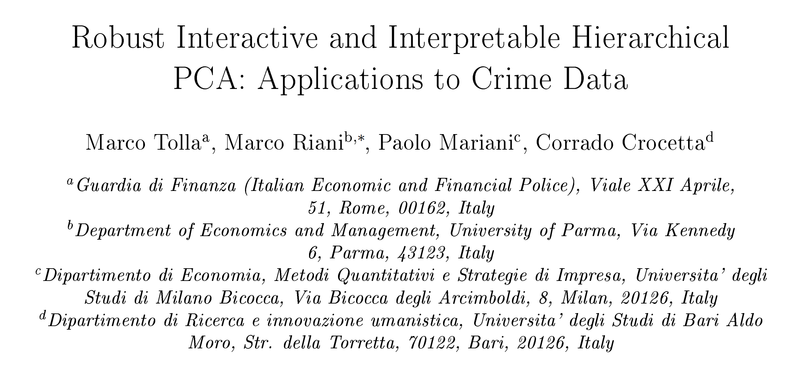
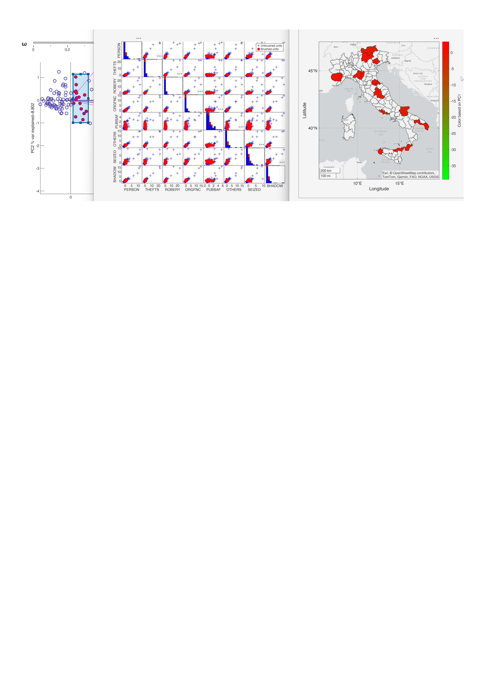

# Robust Interactive and Interpretable Hierarchical PCA: Applications to Crime Data

<table>
  <tr>
<td>
  

    
  

</td>
 <td> <b> <H3>Code to reproduce  the figures of paper "Robust Interactive and Interpretable Hierarchical PCA: Applications to Crime Data" </H3></b> </td>
  </tr>
</table>

Note: in order to run the files below you need to have [FSDA toolbox](https://https://www.mathworks.com/matlabcentral/fileexchange/72999-fsda-flexible-statistics-data-analysis-toolbox) installed

**Abstract**

In a context characterized by increasing institutional complexity and growing constraints on available resources, this paper proposes an interpretable framework for the construction of composite indicators aimed at supporting strategic decision making in public administration with specific emphasis on financial crime data.
Robust statistical methods provide valuable support for analyzing how and where resources should be deployed, enabling data-driven decisions aimed at improving the performance of Public Administrations for the benefit of the community. However, such analyses must produce results that are interpretable, clearly quantify the contribution of each unit, and remain robust in the presence of atypical observations. Furthermore, the inclusion of interactive tools is essential to allow end users to easily explore the characteristics and relative positions of units within the analytical space.
Motivated by these requirements, this paper describes the interactive and interpretable framework based on robust hierarchical principal component analysis for optimizing resources and operational strategies within the Guardia di Finanza (GdF - Italian Economic and Financial Police).

---

In the table below you can find  the original source (MATLAB live script): .mlx file and the corresponding .ipynb file. 

**MATLAB live script files**

The .m file contains the source code without output.

The .mlx file 
contains both the code and the output that the code produces.

The .ipynb file is the Jupiter notebook version of the same file

:eyes: To view the .mlx files click  on the "File Exchange button"

▶️ To run the .mlx files in the free MATLAB on line click on "Run in MATLAB Online". The repo will be automatically cloned. 

The Jupiter notebook version of the files is also given in the last column of the table below. Similarly to the .mlx files the Jupiter notebook files also contain both the code and the output produced by the code.

**Jupiter notebook files**

To view the .ipynb files click on the corresponding link.

To run the .ipynb files inside the agnostic environment jupiter notebook follow the instructions in the file
[ipynbRunInstructions.md](https://github.com/UniprJRC/MonitoringBook/blob/main/ipynbRunInstructions.md). 

| FileName | View :eyes:| Run ▶️ | Jupiter notebook |
| -------- | ---- | --- | ---- |
|mainTRMC.mlx generate Figures 2 and 3  |  |   | [mainTRMC.ipynb](https://github.com/MarcoRianiUNIPR/TRMC/blob/main/mainTRMC.ipynb) |

For evident reasons in the input file CRIM.mat the names of the provinces are shown with the labels P1, P2, ....

Remark: in order to run the files we assume that the free MATLAB Add On FSDA must be installed.

---

